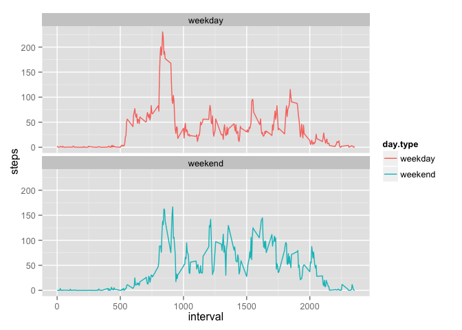

# Reproducible Research: Peer Assessment 1
Rose Nyameke  
November 14, 2015  


## Loading and preprocessing the data

```r
data <- read.csv("activity.csv")
library(dplyr)
```

```
## 
## Attaching package: 'dplyr'
## 
## The following objects are masked from 'package:stats':
## 
##     filter, lag
## 
## The following objects are masked from 'package:base':
## 
##     intersect, setdiff, setequal, union
```

```r
library(ggplot2)
library(chron)

#putting date in correct format
data$date <- as.POSIXct(data$date)

#creating a table without the NAs
data_without_na <- na.omit(data)

#creating a .tbl with dplyr package for grouping by date
data_tbl_without_na <- tbl_df(data_without_na)
data_tbl_without_na <- group_by(data_tbl_without_na, date)
```

## What is mean total number of steps taken per day?

```r
#total number of steps per day
steps_per_day <- summarize(data_tbl_without_na, sum(steps))
     #renaming column
     names(steps_per_day)[2] <- "steps"

#histogram of steps per day
ggplot(data = steps_per_day, aes(x = steps)) + geom_histogram()
```

 

```r
#mean of steps taken per day
mean(steps_per_day$steps)
```

```
## [1] 10766.19
```

```r
#median steps per day
median(steps_per_day$steps)
```

```
## [1] 10765
```

## What is the average daily activity pattern?

```r
#group table by interval
data_group_int <- group_by(data_tbl_without_na, interval)

#mean of steps taken per interval, across days
data_mean_int <- summarize(data_group_int, mean(steps, na.rm=T))
     #rename column
     names(data_mean_int)[2] <- "steps"
     
#time series plot
ggplot(data = data_mean_int, aes(x = interval, y = steps)) + geom_line(aes(group = 1))
```

 

```r
#5 minute interval with max number of steps
data_mean_int[which(data_mean_int$steps == max(data_mean_int$steps)),1]
```

```
## Source: local data frame [1 x 1]
## 
##   interval
## 1      835
```

## Imputing missing values

```r
#number of NAs
sum(is.na(data$steps))
```

```
## [1] 2304
```

```r
#using mean per interval for replacing dates
     #creating a new data set
     new_data <- data
     
     #variable for holding intervals
     interval <- matrix()
     
     #filling in the missing NAs with the mean for that interval across all days
     for (i in 1:length(new_data$steps)) {
          if (is.na(new_data$steps[i])) {
                  interval[i] <- new_data$interval[i]
                  int.value <- interval[i]
                  new_data$steps[i] <- subset(data_mean_int, interval == int.value)[1,2]
          }
     }
     
     #cleaning the new table
     new_data$steps <- as.numeric(new_data$steps)
     
#creating a data_tbl for the new data
new_data_tbl <- tbl_df(new_data)

#group by date
new_data_tbl_date <- group_by(new_data_tbl, date)

#total number of steps per day
new_steps_per_day <- summarize(new_data_tbl_date, sum(steps))

#renaming column
names(new_steps_per_day)[2] <- "steps"

#histogram of steps per day
ggplot(data = new_steps_per_day, aes(x = steps)) + geom_histogram()
```

 

```r
#mean of steps taken per day
mean(new_steps_per_day$steps)
```

```
## [1] 10766.19
```

```r
#median steps per day
median(new_steps_per_day$steps)
```

```
## [1] 10766.19
```

```r
#mean did not change, but median did. There was an increase in the total daily
#number of steps
```


## Are there differences in activity patterns between weekdays and weekends?

```r
#checking if days are weekends or weekdays
for (i in 1:length(new_data$date)){
     if (is.weekend(new_data$date[i])){
          new_data$day.type[i] <- "weekend"
     }
     
     else new_data$day.type[i] <- "weekday"
}

#making the day.type column a factor
new_data$day.type <- as.factor(new_data$day.type)

#time series plot
     #group table by interval
     new_data_group_int <- group_by(new_data, interval, day.type)
     
     #mean of steps taken per interval, across days
     new_data_mean_int <- summarize(new_data_group_int, mean(steps, na.rm=T))
          #rename column
          names(new_data_mean_int)[3] <- "steps"
          
     #time series plot
     ggplot(data = new_data_mean_int, aes(x = interval, y = steps, , color = day.type)) +
          geom_line(aes(group = 1)) + facet_wrap(~day.type)
```

 
